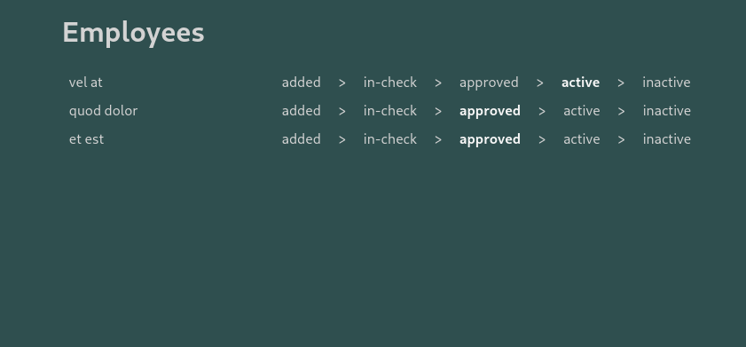

# frontend-challenge

My notes:

- To run, please try `npm run dev`.
- Lists three new random employees on each reload.
- Used Vite ts react app creator. Why? was just curious how fast it is. Just removed some extra files.
- I mostly ended up playing with useQuery and useMutation ideas, as we used
  to have urql in my previous job! Wondering how it might look like.
- Added few comments in the code to explain more.

Thanks for your time!

## Context

Workmotion (www.workmotion.com) is a global HR platform enabling companies to hire & onboard their employees internationally, at the push of a button. It is our mission to create opportunities for anyone to work from anywhere. As work is becoming even more global and remote, there has never been a bigger chance to build a truly global HR-tech company.

As a part of our frontend engineering team, you will be responsible for building our core platform frontend

## Task

We're currently developing an employees managment system.

The employee have four different states including the following

- ADDED
- IN-CHECK
- APPROVED
- ACTIVE
- INACTIVE

Your task is to build a frontend application using React / Typescript including the following features.

- A simple UI listing the employees
  The application need to use an API endpoint to retrieve the employee's list, Unfortunately the API endpoint isn't developed yet, We recommend using a tool to mock your API with the following specification :

  - GET /employees/
  - POST /employees/
  - PATCH /employees/{employee_id}

- In Every employee row, there should be a component as per the provided picture which will be used to display the current state of this employee and by clicking on another state e.g. APPROVED , it should persist that change to this given employee.

## Submitting your solution

1. Create a private GitHub repo
2. Add your solution containing a `README.ME` for setup instructions to the repo.
3. Invite the GitHub user `WorkMotionRecruiting` as a collaborator to the repo
